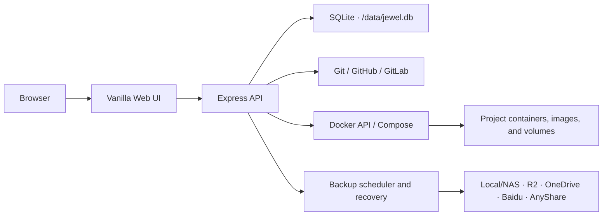

<p align="center">
  
</p>

<h1 align="center">Jewel</h1>

<p align="center">
  A lightweight Git → Docker Compose deployment and operations platform for a single Docker host
</p>

<p align="center">
  <a href="./README.md">简体中文</a> ·
  <a href="./README.en.md"><strong>English</strong></a> ·
  <a href="./README.ja.md">日本語</a>
</p>

<p align="center">
  <a href="https://github.com/LYOfficial/Jewel/blob/main/LICENSE"></a>
  
  
  <a href="https://github.com/LYOfficial/Jewel/stargazers"></a>
</p>

---

Jewel is a self-hosted deployment console inspired by Dokploy and Portainer. It brings Git repositories, Docker Compose projects, containers, images, named volumes, deployment diagnostics, and data backups into one focused web interface. It is designed for project testing, personal services, lab environments, and lightweight long-running deployments.

> [!IMPORTANT]
> Jewel focuses on a single Docker host. It does not manage DNS, reverse proxies, TLS certificates, or multi-node orchestration. Pair it with Caddy, Traefik, Nginx Proxy Manager, or another edge service when those capabilities are required.

## Table of contents

- [Why Jewel](#why-jewel)
- [Features](#features)
- [Architecture](#architecture)
- [Quick start](#quick-start)
- [First login](#first-login)
- [Backup center](#backup-center)
- [Built-in self-update](#built-in-self-update)
- [Configuration](#configuration)
- [Local development](#local-development)
- [Repository layout](#repository-layout)
- [Security](#security)
- [FAQ](#faq)
- [Contributing](#contributing)
- [License](#license)

## Why Jewel

- **Lightweight by design** — vanilla HTML, CSS, and JavaScript with no frontend build pipeline; one Node.js process and SQLite.
- **Built for deployment testing** — repository cloning, Compose builds, failure logs, and diagnostics form one workflow.
- **Connected resource views** — inspect project containers, images, named volumes, bind mounts, commits, and operation history together.
- **AI-friendly errors** — failed clones, deployments, rebuilds, and backups produce redacted, copy-ready diagnostic reports.
- **Suitable for long-running services** — volume backups, scheduling, consistent pause/resume, crash recovery, and staging retention are built in.
- **Controlled updates** — updates require manual confirmation, validate a candidate container, and roll back automatically when startup fails.

## Features

| Area | Capabilities |
|---|---|
| Project deployment | Clone a Git repository, select a branch and Compose file, edit environment variables, deploy, stop, restart, and rebuild |
| Git integration | GitHub, GitLab, and self-hosted GitLab token management and repository selection |
| Docker operations | Inspect and operate containers, images, ports, logs, statistics, mounts, terminals, and container files |
| Resource relationships | Aggregate containers, images, named volumes, bind mounts, commit state, and operations per project |
| Deployment diagnostics | Persist operation results and logs, redact common secrets, and generate copy-ready reports |
| Volume backups | Select project named volumes and paths inside them; run manually or on a fixed hourly interval |
| Backup consistency | Pause only containers that were running, resume after upload, and recover after an interrupted Jewel restart |
| Storage targets | Local/NAS, Cloudflare R2, OneDrive, Baidu Netdisk, and AnyShare |
| System management | Host status, account settings, localized UI, operator notes, and manually triggered self-update |

## Architecture



The Jewel container manages the host Docker daemon through `/var/run/docker.sock`. Application state, the SQLite database, project working trees, and backup staging files live under `/data`.

## Quick start

### Requirements

- A Linux host
- Docker Engine, accessible by the current user
- Git
- An available host port; the default is `330`

### Standard installation (recommended)

Download and review the installer before running it:

```bash
curl -fsSL https://raw.githubusercontent.com/LYOfficial/Jewel/main/install.sh -o install.sh
chmod +x install.sh
sudo ./install.sh
```

Use a custom host port:

```bash
sudo ./install.sh 8080
```

The installer will:

1. clone Jewel into a temporary directory;
2. build a candidate image with commit metadata;
3. create or reuse the `jewel-data` volume;
4. generate a JWT secret on first install;
5. start and verify the replacement container;
6. restore the previous container if the update fails.

Open `http://your-server:330` after installation, replacing `330` when a custom port is used.

### Docker Compose (advanced)

Use Compose when you need to review the source, customize the deployment, or own the upgrade process:

```bash
git clone https://github.com/LYOfficial/Jewel.git
cd Jewel

export JEWEL_COMMIT="$(git rev-parse HEAD)"
export JWT_SECRET="$(openssl rand -hex 32)"

docker compose up -d --build
```

Update a Compose-managed installation manually:

```bash
git pull --ff-only
export JEWEL_COMMIT="$(git rev-parse HEAD)"
docker compose up -d --build
```

If Jewel's built-in updater is triggered from a Compose deployment, the first update hands lifecycle management over to the canonical standalone `install.sh` flow.

## First login

| Field | Default |
|---|---|
| URL | `http://your-server:330` |
| Username | `admin` |
| Password | `adminwithjewel` |

The password must be changed on first login. Change it before adding Git tokens or backup credentials, and expose the administration interface only to trusted networks.

## Backup center

Jewel backs up **Docker named volumes** associated with a project. Bind mounts are shown in the project resource view, but they are not currently packaged by backup plans.

Backup tasks can:

- select one or more named volumes;
- archive `/` or selected paths inside each volume;
- run manually or at a fixed hourly interval;
- pause project containers that were running before the backup;
- stream compressed archives to the selected destination;
- resume containers after transfer;
- continue container recovery after Jewel or the host restarts;
- keep a configurable number of local staging batches, including zero.

| Storage type | Implementation | Main configuration |
|---|---|---|
| Local / NAS | File copy | A writable path inside the Jewel container; mount NAS storage into the container when needed |
| Cloudflare R2 | rclone S3-compatible mode | Endpoint, bucket, Access Key ID, and Secret Access Key |
| OneDrive | rclone | Existing remote, or token JSON, Drive ID, and Drive Type |
| Baidu Netdisk | bypy | A persistent bypy authorization directory |
| AnyShare | anyshare-unofficial | An upload-enabled public share and an existing destination directory |

The production image includes `rclone`, `bypy`, and `anyshare-unofficial`. The connection check performs a read-only remote request instead of only checking whether a command is installed.

## Built-in self-update

Jewel checks the GitHub `main` branch for new commits, but it never installs them automatically. An administrator must confirm every update.

Update flow:

1. a helper container downloads the canonical installer;
2. source is cloned and a candidate image is built while the current Jewel instance stays online;
3. the old container is retained as a rollback point after the build succeeds;
4. the new container receives a readiness check for up to 30 seconds;
5. the old container is removed on success or restored after failure or interruption.

The updater preserves the current `/data` mount, host port, JWT secret, Docker read timeout, and backup helper image setting.

## Configuration

### Application environment variables

| Variable | Default | Description |
|---|---|---|
| `PORT` | `330` | Internal Jewel listening port |
| `DATA_DIR` | `./data` | Data directory; `/data` in the standard container |
| `JWT_SECRET` | Generated by the installer | JWT signing secret; set it explicitly when running Node.js directly |
| `NODE_ENV` | `development` | Runtime environment; `production` in the container |
| `DOCKER_READ_TIMEOUT_MS` | `8000` | Timeout for read-only Docker queries; minimum 1000 ms |
| `BACKUP_HELPER_IMAGE` | `busybox:1.36` | Helper image used to archive named volumes read-only |
| `JEWEL_COMMIT` | `unknown` | Git commit represented by the current build |

### Installer variables

| Variable | Default | Description |
|---|---|---|
| `JEWEL_PORT` | `330` | Host port used when no positional port argument is provided |
| `JEWEL_IMAGE` | `jewel:latest` | Local image name |
| `JEWEL_CONTAINER` | `jewel` | Container name |
| `JEWEL_DATA_SOURCE` | `jewel-data` | Docker volume name or absolute host directory |
| `JEWEL_REPOSITORY` | Official GitHub repository | Repository cloned by the installer |
| `JEWEL_BRANCH` | `main` | Branch or tag cloned by the installer |

### Persistent data

| Path | Contents |
|---|---|
| `/data/jewel.db` | Users, projects, settings, tokens, operation history, and backup configuration |
| `/data/projects/` | Cloned project working trees |
| `/data/backups/staging/` | Local staging archives created by backup tasks |

## Local development

Local development requires Node.js 20+ and an accessible Docker daemon:

```bash
git clone https://github.com/LYOfficial/Jewel.git
cd Jewel
npm ci

export JWT_SECRET="development-only-secret"
npm run dev
```

Run the project checks:

```bash
npm test
npm run check
```

`npm test` uses the built-in Node.js test runner. `npm run check` validates JavaScript, language JSON, Compose YAML, and installer shell syntax.

## Repository layout

```text
Jewel/
├── public/                 # Vanilla frontend, styles, icons, and language files
├── scripts/                # Test runner, syntax checks, and AnyShare helper
├── src/                    # Express API, Docker/Git services, database, and backups
├── tests/                  # Node.js tests and UI preview
├── Dockerfile              # Production image
├── docker-compose.yml      # Advanced manually managed deployment
├── install.sh              # Canonical install and self-update entry point
└── package.json
```

## Security

> [!WARNING]
> Mounting the Docker socket gives Jewel high-privilege control over the host Docker daemon. Do not expose the administration interface directly to an untrusted network.

- Change the default password immediately after first login.
- Restrict access with a firewall, VPN, or controlled reverse proxy.
- Terminate HTTPS at an external reverse proxy when remote access is required.
- Git tokens and backup credentials are stored in the Jewel database; protect the `jewel-data` volume and its backups.
- Use least-privilege credentials for Git and storage providers.
- Diagnostic reports redact common secret patterns, but review them before sharing.
- Back up `/data` before migrations, host moves, or mount changes.

## FAQ

<details>
<summary><strong>Does Jewel manage domains or HTTPS certificates?</strong></summary>

No. Jewel does not include DNS, reverse proxy, or certificate management. Run Caddy, Traefik, Nginx Proxy Manager, or a similar service alongside it.
</details>

<details>
<summary><strong>Can Jewel manage multiple Docker hosts or a cluster?</strong></summary>

Not currently. Jewel manages the single Docker host that shares `/var/run/docker.sock` with the Jewel container.
</details>

<details>
<summary><strong>Why are bind mounts missing from backup plans?</strong></summary>

The backup center currently packages Docker named volumes only. Bind mounts remain visible in project resources and should be protected by a host- or NAS-level backup solution.
</details>

<details>
<summary><strong>What happens when Docker is temporarily unavailable?</strong></summary>

Resource pages show a clear degraded-state message. If Jewel restarts while backup-paused containers still require recovery, the task remains recovery-pending and retries every minute.
</details>

## Contributing

Bug reports, improvement proposals, and pull requests are welcome:

1. fork the repository and create a focused branch;
2. keep the change set scoped and explain behavioral changes;
3. run `npm test` and `npm run check`;
4. describe the motivation and verification steps in the pull request.

Do not include real tokens, passwords, databases, or complete private diagnostics in public issues. Use [GitHub Issues](https://github.com/LYOfficial/Jewel/issues) for general reports and feature requests.

## License

Jewel is released under the [MIT License](./LICENSE).

## Acknowledgements

Jewel's product direction is inspired by [Dokploy](https://github.com/Dokploy/dokploy) and [Portainer](https://github.com/portainer/portainer). Backup integrations use or interoperate with `rclone`, `bypy`, and [AnyShare-Unofficial](https://github.com/isHarryh/AnyShare-Unofficial).

<p align="center">Made with ♥ by <a href="https://github.com/LYOfficial">LYOfficial</a></p>
