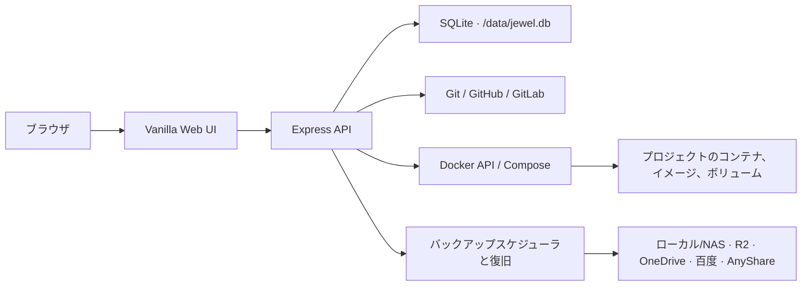

<p align="center">
  
</p>

<h1 align="center">Jewel</h1>

<p align="center">
  単一の Docker ホスト向けに設計された、軽量な Git → Docker Compose デプロイ・運用プラットフォーム
</p>

<p align="center">
  <a href="./README.md">简体中文</a> ·
  <a href="./README.en.md">English</a> ·
  <a href="./README.ja.md"><strong>日本語</strong></a>
</p>

<p align="center">
  <a href="https://github.com/LYOfficial/Jewel/blob/main/LICENSE"></a>
  
  
  <a href="https://github.com/LYOfficial/Jewel/stargazers"></a>
</p>

---

Jewel は Dokploy と Portainer に着想を得たセルフホスト型デプロイコンソールです。Git リポジトリ、Docker Compose プロジェクト、コンテナ、イメージ、名前付きボリューム、デプロイ診断、データバックアップを、ひとつのシンプルな Web UI で管理できます。プロジェクト検証、個人サービス、検証環境、軽量な長期運用に適しています。

> [!IMPORTANT]
> Jewel は単一の Docker ホストに特化しています。DNS、リバースプロキシ、TLS 証明書、マルチノードオーケストレーションは管理しません。必要に応じて Caddy、Traefik、Nginx Proxy Manager などと組み合わせてください。

## Jewel を選ぶ理由

- **軽量な構成** — フロントエンドは素の HTML、CSS、JavaScript。Node.js の単一プロセスと SQLite で動作します。
- **デプロイ検証に最適化** — リポジトリのクローン、Compose ビルド、失敗ログ、診断レポートを一連の流れで扱えます。
- **関連リソースを一括表示** — プロジェクトごとにコンテナ、イメージ、名前付きボリューム、バインドマウント、コミット、操作履歴を確認できます。
- **AI に渡しやすいエラー情報** — クローン、デプロイ、再構築、バックアップの失敗から、機密情報をマスクしたコピー可能な診断レポートを生成します。
- **長期運用にも対応** — ボリュームバックアップ、スケジュール、整合性を保つ一時停止と再開、クラッシュ復旧、ローカル保持設定を備えます。
- **制御された更新** — 更新は手動確認制で、候補コンテナの起動に失敗した場合は旧コンテナへ自動ロールバックします。

## 軽量性の実測値

**Debian 13.6 / KVM** 仮想マシン（AMD EPYC 7302P 16 vCPU、メモリ 15 GiB、ext4 システムディスク 100 GB、Docker Engine 29.5.2）での安定時ダッシュボード値です。

| 指標 | Jewel | 同時刻のホスト |
|---|---:|---:|
| CPU | **0.4%** | 4.8% |
| メモリ | **28.5 MiB** | 3.2 GiB / 15.6 GiB |
| ストレージ | **843.3 MiB** | 21.6 GiB / 98.2 GiB |

アイドル時の Jewel のメモリ使用量はホスト全体の約 **0.18%** です。ストレージはイメージ 501.1 MiB、永続データ 342.2 MiB、書き込み層 0 B で構成されます。データボリュームには SQLite、クローン済みプロジェクト、バックアップ一時ファイルが含まれ、実行プロセスのオーバーヘッドではありません。イメージには Git、Docker CLI、Compose、バックアップツールが含まれるため、すぐに運用可能なプラットフォーム全体のサイズです。

ダッシュボードは Jewel コンテナ自身を測定します。CPU とメモリは Docker 統計、ストレージはイメージ + 書き込み層 + `jewel-data` です。同時期の `sudo docker stats --no-stream jewel` では CPU 0.43%、メモリ 29.94 MiB でした。更新、プロジェクト、バックアップによってストレージは変わるため、ライブ表示を正とします。

## 主な機能

| 分野 | 機能 |
|---|---|
| プロジェクトデプロイ | Git リポジトリのクローン、ブランチと Compose ファイルの選択、環境変数編集、デプロイ、停止、再起動、再構築、コミット検出によるプロジェクトごとの自動更新デプロイ |
| Git 連携 | GitHub、GitLab、セルフホスト GitLab のトークン管理とリポジトリ選択 |
| Docker 操作 | コンテナ、イメージ、ポート、ログ、統計、マウント、ターミナル、コンテナ内ファイルの確認と操作 |
| リソース関連付け | プロジェクト単位でコンテナ、イメージ、名前付きボリューム、バインドマウント、コミット状態、操作履歴を集約 |
| デプロイ診断 | 操作結果とログを永続化し、一般的な機密情報をマスクしたコピー可能なレポートを生成 |
| ボリュームバックアップ | プロジェクトの名前付きボリュームと内部パスを選択し、手動または一定時間ごとに実行 |
| バックアップ整合性 | 実行中だったコンテナだけを一時停止し、アップロード後に再開。Jewel 再起動後も復旧を継続 |
| 保存先 | ローカル/NAS、Cloudflare R2、OneDrive、百度网盘、AnyShare |
| システム管理 | ホスト状態、アカウント設定、多言語 UI、運用メモ、手動セルフアップデート |

## アーキテクチャ



Jewel コンテナは `/var/run/docker.sock` を通じてホストの Docker デーモンを管理します。アプリケーション状態、SQLite データベース、プロジェクトの作業ツリー、バックアップの一時ファイルは `/data` に保存されます。

### プロジェクトの自動更新

プロジェクト作成時またはデプロイ設定で「自動更新デプロイ」を有効にすると、Jewel は 10 分ごとにリモートブランチを確認します。新しいコミットを検出した実行中のプロジェクトは自動で pull・再デプロイされ、結果は操作履歴とデプロイログに記録されます。手動で停止したプロジェクトは更新ありとして表示するだけで、自動起動はしません。

## クイックスタート

### 必要環境

- Linux ホスト
- 現在のユーザーから利用できる Docker Engine
- Git
- 利用可能なホストポート（既定値は `330`）

### 標準インストール（推奨）

インストーラーをダウンロードし、内容を確認してから実行してください。

```bash
curl -fsSL https://raw.githubusercontent.com/LYOfficial/Jewel/main/install.sh -o install.sh
chmod +x install.sh
sudo ./install.sh
```

ホストポートを変更する場合：

```bash
sudo ./install.sh 8080
```

インストーラーは次の処理を行います。

1. 一時ディレクトリへ Jewel をクローンする；
2. コミット情報を含む候補イメージをビルドする；
3. `jewel-data` ボリュームを作成または再利用する；
4. 初回インストール時に JWT シークレットを生成する；
5. 新しいコンテナを起動して動作確認する；
6. 更新に失敗した場合は以前のコンテナを復元する。

インストール後、`http://サーバーアドレス:330` を開いてください。カスタムポートを使用した場合は `330` を置き換えます。

### Docker Compose（上級者向け）

ソースの確認、設定のカスタマイズ、手動でのライフサイクル管理が必要な場合に使用します。

```bash
git clone https://github.com/LYOfficial/Jewel.git
cd Jewel

export JEWEL_COMMIT="$(git rev-parse HEAD)"
export JWT_SECRET="$(openssl rand -hex 32)"

docker compose up -d --build
```

Compose 管理のインストールは、次のように手動更新してください。

```bash
git pull --ff-only
export JEWEL_COMMIT="$(git rev-parse HEAD)"
docker compose up -d --build
```

Compose デプロイから Jewel の内蔵アップデーターを実行すると、最初の更新後は標準の `install.sh` によるスタンドアロン管理へ移行します。

## 初回ログイン

| 項目 | 既定値 |
|---|---|
| URL | `http://サーバーアドレス:330` |
| ユーザー名 | `admin` |
| パスワード | `adminwithjewel` |

初回ログイン時にパスワード変更が必須です。Git トークンやバックアップ認証情報を登録する前に変更し、管理画面は信頼できるネットワークからのみ利用してください。

## バックアップセンター

Jewel がバックアップする対象は、プロジェクトに関連付けられた **Docker の名前付きボリューム** です。バインドマウントはプロジェクトのリソース画面に表示されますが、現在のバックアッププランでは直接アーカイブされません。

バックアップタスクでは次の操作が可能です。

- 1 つ以上の名前付きボリュームを選択；
- 各ボリュームの `/` または特定の内部パスをアーカイブ；
- 手動実行または一定時間間隔での自動実行；
- バックアップ前に実行中だったプロジェクトコンテナを一時停止；
- 圧縮アーカイブをストリーミング生成してアップロード；
- 転送後にコンテナを再開；
- Jewel またはホストの再起動後も一時停止コンテナの復旧を継続；
- ローカル一時アーカイブの保持世代数を設定。`0` で即時削除。

| 保存先 | 実装 | 主な設定 |
|---|---|---|
| ローカル / NAS | ファイルコピー | Jewel コンテナ内の書き込み可能パス。必要に応じて NAS を追加マウント |
| Cloudflare R2 | rclone の S3 互換モード | Endpoint、Bucket、Access Key ID、Secret Access Key |
| OneDrive | rclone | 既存 remote、または Token JSON、Drive ID、Drive Type |
| 百度网盘 | bypy | 永続化された bypy 認証設定ディレクトリ |
| AnyShare | anyshare-unofficial | アップロード可能な公開共有リンクと既存の保存先ディレクトリ |

本番イメージには `rclone`、`bypy`、`anyshare-unofficial` が含まれます。接続確認では、コマンドの存在確認だけでなく、読み取り専用のリモートアクセスを実行します。

## 内蔵セルフアップデート

Jewel は GitHub の `main` ブランチに新しいコミットがあるか確認しますが、自動インストールは行いません。すべての更新で管理者の手動確認が必要です。

更新の流れ：

1. ヘルパーコンテナが標準インストーラーをダウンロード；
2. 現在の Jewel を稼働させたまま、ソースをクローンして候補イメージをビルド；
3. ビルド成功後、旧コンテナをロールバックポイントとして保持；
4. 新コンテナを起動し、最大 30 秒の準備確認を実行；
5. 成功時は旧コンテナを削除し、失敗または中断時は自動復元。

更新時には現在の `/data` マウント、ホストポート、JWT シークレット、Docker 読み取りタイムアウト、バックアップ用ヘルパーイメージ設定が維持されます。

## 設定リファレンス

### アプリケーション環境変数

| 変数 | 既定値 | 説明 |
|---|---|---|
| `PORT` | `330` | Jewel コンテナ内部の待ち受けポート |
| `DATA_DIR` | `./data` | データディレクトリ。標準コンテナでは `/data` |
| `JWT_SECRET` | インストーラーが生成 | JWT 署名用シークレット。Node.js を直接実行する場合は明示的に設定 |
| `NODE_ENV` | `development` | 実行環境。コンテナでは `production` |
| `DOCKER_READ_TIMEOUT_MS` | `8000` | Docker の読み取り専用問い合わせタイムアウト。最小 1000 ms |
| `BACKUP_HELPER_IMAGE` | `busybox:1.36` | 名前付きボリュームを読み取り専用でアーカイブするヘルパーイメージ |
| `JEWEL_COMMIT` | `unknown` | 現在のビルドに対応する Git コミット |

### インストーラー変数

| 変数 | 既定値 | 説明 |
|---|---|---|
| `JEWEL_PORT` | `330` | ポート位置引数を省略した場合のホストポート |
| `JEWEL_IMAGE` | `jewel:latest` | ローカルイメージ名 |
| `JEWEL_CONTAINER` | `jewel` | コンテナ名 |
| `JEWEL_DATA_SOURCE` | `jewel-data` | Docker ボリューム名またはホストの絶対パス |
| `JEWEL_REPOSITORY` | 公式 GitHub リポジトリ | インストーラーがクローンするリポジトリ |
| `JEWEL_BRANCH` | `main` | インストーラーがクローンするブランチまたはタグ |

### 永続化データ

| パス | 内容 |
|---|---|
| `/data/jewel.db` | ユーザー、プロジェクト、設定、トークン、操作履歴、バックアップ設定 |
| `/data/projects/` | クローンされたプロジェクトの作業ツリー |
| `/data/backups/staging/` | バックアップタスクが作成するローカル一時アーカイブ |

## ローカル開発

Node.js 20+ と利用可能な Docker デーモンが必要です。

```bash
git clone https://github.com/LYOfficial/Jewel.git
cd Jewel
npm ci

export JWT_SECRET="development-only-secret"
npm run dev
```

検証コマンド：

```bash
npm test
npm run check
```

`npm test` は Node.js 標準のテストランナーを使用します。`npm run check` は JavaScript、言語 JSON、Compose YAML、インストーラーのシェル構文を検証します。

## リポジトリ構成

```text
Jewel/
├── public/                 # フロントエンド、スタイル、アイコン、言語ファイル
├── scripts/                # テストランナー、構文検査、AnyShare ヘルパー
├── src/                    # Express API、Docker/Git サービス、DB、バックアップ
├── tests/                  # Node.js テストと UI プレビュー
├── Dockerfile              # 本番イメージ
├── docker-compose.yml      # 上級者向け手動デプロイ設定
├── install.sh              # 標準インストールとセルフ更新の入口
└── package.json
```

## セキュリティ

> [!WARNING]
> Docker Socket のマウントにより、Jewel はホストの Docker デーモンに対する強い権限を持ちます。管理画面を信頼できないネットワークへ直接公開しないでください。

- 初回ログイン後、直ちに既定パスワードを変更してください。
- ファイアウォール、VPN、制御されたリバースプロキシでアクセス元を制限してください。
- 外部アクセスが必要な場合は、外部リバースプロキシで HTTPS を終端してください。
- Git トークンとバックアップ認証情報は Jewel のデータベースに保存されます。`jewel-data` とそのバックアップを保護してください。
- Git とストレージサービスには最小権限の認証情報を使用してください。
- 診断レポートは一般的な機密情報をマスクしますが、共有前に内容を確認してください。
- 移行、ホスト変更、マウント変更の前に `/data` をバックアップしてください。

## よくある質問

<details>
<summary><strong>ドメインや HTTPS 証明書を管理できますか？</strong></summary>

いいえ。Jewel は DNS、リバースプロキシ、証明書管理を含みません。Caddy、Traefik、Nginx Proxy Manager などを併用してください。
</details>

<details>
<summary><strong>複数の Docker ホストやクラスターを管理できますか？</strong></summary>

現在は対応していません。Jewel は `/var/run/docker.sock` を共有する単一の Docker ホストを管理します。
</details>

<details>
<summary><strong>バックアッププランにバインドマウントが表示されないのはなぜですか？</strong></summary>

現在のバックアップセンターは Docker の名前付きボリュームだけをアーカイブします。バインドマウントはプロジェクトリソースに表示されますが、ホストまたは NAS 側のバックアップで保護してください。
</details>

<details>
<summary><strong>Docker が一時的に利用できない場合はどうなりますか？</strong></summary>

リソース画面には明確な縮退メッセージが表示されます。バックアップで一時停止したコンテナの復旧中に Jewel が再起動した場合、タスクは復旧待ちのまま 1 分ごとに再試行します。
</details>

## コントリビューション

バグ報告、改善提案、Pull Request を歓迎します。

1. リポジトリを Fork し、目的を限定したブランチを作成；
2. 変更範囲を明確にし、動作変更を説明；
3. `npm test` と `npm run check` を実行；
4. Pull Request に目的と検証方法を記載。

公開 Issue に実際のトークン、パスワード、データベース、非公開の完全な診断ログを添付しないでください。一般的な報告や機能要望は [GitHub Issues](https://github.com/LYOfficial/Jewel/issues) から送信できます。

## ライセンス

Jewel は [GNU General Public License v3.0](./LICENSE) の下で公開されています。

<p align="center">Made with ♥ by <a href="https://github.com/LYOfficial">LYOfficial</a></p>
