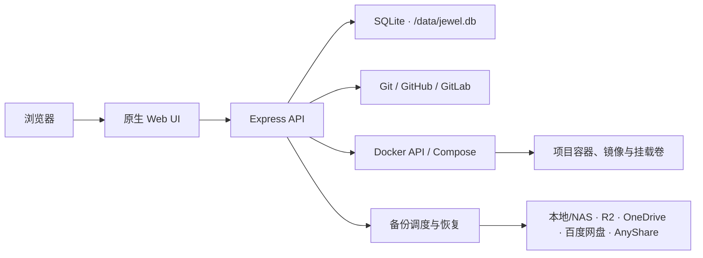

<p align="center">
  
</p>

<h1 align="center">Jewel</h1>

<p align="center">
  面向单台 Docker 主机的轻量级 Git → Docker Compose 部署与运维平台
</p>

<p align="center">
  <a href="./README.md"><strong>简体中文</strong></a> ·
  <a href="./README.en.md">English</a> ·
  <a href="./README.ja.md">日本語</a>
</p>

<p align="center">
  <a href="https://github.com/LYOfficial/Jewel/blob/main/LICENSE"></a>
  
  
  <a href="https://github.com/LYOfficial/Jewel/stargazers"></a>
</p>

---

Jewel 是一个受 Dokploy 与 Portainer 启发的自托管部署控制台。它将 Git 仓库、Docker Compose 项目、容器、镜像、命名卷、部署诊断和数据备份集中到一个简洁的 Web 界面中，适合项目测试、个人服务、实验环境和需要长期运行的轻量部署场景。

> [!IMPORTANT]
> Jewel 专注于单机 Docker 部署，不负责域名解析、反向代理、TLS 证书签发或多节点编排。如果你需要完整 PaaS、集群调度或内置网关，应配合 Caddy、Traefik、Nginx Proxy Manager 等工具，或选择更完整的平台。

## 实测：运行开销保持在很低水平

在一台 **Debian 13.6 / KVM** 虚拟机（16 vCPU AMD EPYC 7302P、15 GiB 内存、100 GB ext4 系统盘、Docker Engine 29.5.2）上，Jewel 稳定运行时的仪表盘采样如下：

| 指标 | Jewel 平台 | 同时刻主机 |
|---|---:|---:|
| CPU | **0.4%** | 4.8% |
| 内存 | **28.5 MiB** | 3.2 GiB / 15.6 GiB |
| 存储 | **843.3 MiB** | 21.6 GiB / 98.2 GiB |

这意味着 Jewel 的稳定态内存约占主机总内存 **0.18%**，CPU 占用仅 **0.4%**。存储由约 **501.1 MiB** 镜像和 **342.2 MiB** 持久化数据卷组成，容器可写层为 **0 B**；其中数据卷承载 SQLite、克隆项目与备份暂存，并非运行时进程开销。镜像中包含 Git、Docker CLI、Compose 及备份工具，因此它代表的是可直接运维的完整平台，而不是一个只提供 Web 页面的小型运行时。

> 数据来自 Jewel 仪表盘稳定态及 `sudo docker stats --no-stream jewel` 的同次验证（CLI 为 0.43% CPU、29.94 MiB 内存）。仪表盘采用二进制单位 MiB/GiB；Docker CLI 的十进制 MB/GB 会将同一镜像与数据卷显示为约 525 MB 和 358.8 MB。镜像与数据卷会随自更新、项目和备份变化，存储数值应以实时仪表盘为准。

轻量化也来自架构本身：原生 HTML、CSS、JavaScript 无前端构建链；单个 Node.js 进程配合 SQLite；直接使用宿主机 Docker API，不额外引入集群控制面。

## 核心能力

| 模块 | 能力 |
|---|---|
| 项目部署 | 从 Git 仓库克隆项目，选择分支和 Compose 文件，配置环境变量，执行部署、停止、重启、重构；可按项目自动检查新提交并更新部署 |
| Git 集成 | GitHub、GitLab 和自托管 GitLab 令牌管理及仓库选择 |
| Docker 管理 | 查看并操作容器、镜像、端口、日志、资源占用、挂载、终端和容器文件 |
| 资源联动 | 在项目维度聚合容器、镜像、命名卷、目录挂载、提交状态和操作历史 |
| 部署诊断 | 持久化操作结果与日志，自动隐藏常见密码和令牌，生成可复制诊断报告 |
| 卷备份 | 选择项目命名卷及卷内目录，手动或按小时周期执行备份 |
| 备份一致性 | 仅暂停原本运行中的项目容器，上传完成后恢复；异常重启后继续恢复 |
| 存储目标 | 本地/NAS、Cloudflare R2、OneDrive、百度网盘、AnyShare |
| 系统管理 | 主机状态、用户设置、多语言界面、系统备注和手动自更新 |

## 系统架构



Jewel 容器通过 `/var/run/docker.sock` 管理宿主机 Docker。应用数据、SQLite 数据库、项目工作目录和备份暂存文件统一保存在 `/data`。

### 项目自动更新

创建项目或在项目详情的“部署”设置中启用“自动更新部署”后，Jewel 每 10 分钟检查一次远端分支。发现新提交时，会自动拉取并重新部署该项目，并将结果记录在操作历史和部署日志中。为尊重手动停止操作，已停止的项目只会显示“有更新”，不会被自动启动。

## 快速开始

### 环境要求

- Linux 主机
- Docker Engine，并确保当前用户可以访问 Docker 守护进程
- Git
- 可用的宿主机端口，默认 `330`

### 标准安装方式（推荐）

建议先下载并检查安装脚本，再执行：

```bash
curl -fsSL https://raw.githubusercontent.com/LYOfficial/Jewel/main/install.sh -o install.sh
chmod +x install.sh
sudo ./install.sh
```

自定义宿主机端口：

```bash
sudo ./install.sh 8080
```

安装器将完成以下工作：

1. 在临时目录克隆 Jewel；
2. 构建带提交版本信息的候选镜像；
3. 创建或复用 `jewel-data` 数据卷；
4. 自动生成 JWT 密钥；
5. 启动并检查新容器；
6. 更新失败时恢复旧容器。

安装完成后访问 `http://服务器地址:330`，使用自定义端口时替换 `330`。

### Docker Compose（高级方式）

适合需要审查源码、修改 Compose 配置或自行控制升级流程的用户：

```bash
git clone https://github.com/LYOfficial/Jewel.git
cd Jewel

export JEWEL_COMMIT="$(git rev-parse HEAD)"
export JWT_SECRET="$(openssl rand -hex 32)"

docker compose up -d --build
```

Compose 模式建议使用以下方式手动升级：

```bash
git pull --ff-only
export JEWEL_COMMIT="$(git rev-parse HEAD)"
docker compose up -d --build
```

如果在 Compose 部署中触发 Jewel 内部自更新，第一次更新后实例会交由标准 `install.sh` 独立容器模式管理。

## 首次登录

| 项目 | 默认值 |
|---|---|
| 地址 | `http://服务器地址:330` |
| 用户名 | `admin` |
| 密码 | `adminwithjewel` |

首次登录必须修改密码。建议在创建任何 Git 令牌或备份凭据前完成密码修改，并仅在可信网络中开放管理界面。

## 备份中心

Jewel 的备份对象是项目关联的 **Docker 命名卷**。目录挂载会显示在项目资源中，但当前不会被备份计划直接打包。

备份任务支持：

- 选择一个或多个命名卷；
- 为每个卷选择 `/` 或指定卷内子目录；
- 手动执行或按固定小时间隔自动执行；
- 备份前暂停项目中原本运行的容器；
- 流式生成压缩归档并上传；
- 上传结束后恢复容器；
- Jewel 或宿主机异常重启后继续恢复被暂停容器；
- 保留最近若干批本地暂存归档，或上传后立即清理。

| 存储类型 | 实现方式 | 主要配置 |
|---|---|---|
| 本地 / NAS | 文件复制 | Jewel 容器内可写目录；NAS 可通过额外挂载接入 |
| Cloudflare R2 | rclone S3 兼容模式 | Endpoint、Bucket、Access Key ID、Secret Access Key |
| OneDrive | rclone | 已有 remote，或 Token JSON、Drive ID 和 Drive Type |
| 百度网盘 | bypy | 持久化的 bypy 授权配置目录 |
| AnyShare | anyshare-unofficial | 允许上传的公开分享链接及已存在的目标目录 |

Docker 镜像已包含 `rclone`、`bypy` 和 `anyshare-unofficial`。存储目标的“连接检查”会执行只读远端访问。

## 内部自更新

Jewel 会检查 GitHub `main` 分支是否存在更新，但不会自动安装。只有管理员手动确认后才会启动更新。

更新流程：

1. 辅助容器下载标准安装脚本；
2. 当前 Jewel 仍在线时克隆源码并构建候选镜像；
3. 构建成功后将旧容器保留为回滚点；
4. 启动新容器并进行最多 30 秒的就绪检查；
5. 成功后删除旧容器，失败或中断时自动恢复。

更新会继承当前 `/data` 挂载、宿主机端口、JWT 密钥、Docker 读取超时和备份辅助镜像设置。

## 配置参考

### 应用环境变量

| 变量 | 默认值 | 说明 |
|---|---|---|
| `PORT` | `330` | Jewel 容器内部监听端口 |
| `DATA_DIR` | `./data` | 数据目录；标准容器中为 `/data` |
| `JWT_SECRET` | 安装器自动生成 | JWT 签名密钥；直接运行 Node.js 时必须自行设置 |
| `NODE_ENV` | `development` | 运行环境；容器中为 `production` |
| `DOCKER_READ_TIMEOUT_MS` | `8000` | Docker 只读查询超时时间，最小 1000 毫秒 |
| `BACKUP_HELPER_IMAGE` | `busybox:1.36` | 以只读方式打包命名卷的辅助镜像 |
| `JEWEL_COMMIT` | `unknown` | 当前构建对应的 Git 提交，用于版本检测 |

### 安装器变量

| 变量 | 默认值 | 说明 |
|---|---|---|
| `JEWEL_PORT` | `330` | 未传递位置参数时使用的宿主机端口 |
| `JEWEL_IMAGE` | `jewel:latest` | 本地镜像名 |
| `JEWEL_CONTAINER` | `jewel` | 容器名 |
| `JEWEL_DATA_SOURCE` | `jewel-data` | Docker 卷名或绝对宿主机目录 |
| `JEWEL_REPOSITORY` | 官方 GitHub 仓库 | 安装器克隆地址 |
| `JEWEL_BRANCH` | `main` | 安装器克隆的分支或标签 |
| `JEWEL_NODE_IMAGE` | `node:20-alpine` | Jewel 构建使用的 Node 基础镜像；Docker Hub 不可达时可指定可访问的镜像仓库地址 |
| `JEWEL_IMAGE_PULL_RETRIES` | `3` | 安装器拉取基础镜像的最大尝试次数 |

### 持久化数据

| 路径 | 内容 |
|---|---|
| `/data/jewel.db` | 用户、项目、设置、令牌、操作记录和备份配置 |
| `/data/projects/` | 克隆的项目工作目录 |
| `/data/backups/staging/` | 备份任务的本地暂存归档 |

## MCP 服务：让 AI 在受限范围内维护 Jewel

Jewel 内置了符合 **Streamable HTTP** 传输方式的 MCP 服务。支持 MCP 的 AI 客户端可以读取项目状态、操作历史、部署日志、失败诊断和运行日志，并在已有项目上执行部署、检查更新、拉取更新并部署、重构、重启，以及检查或应用 Jewel 自身更新。

MCP **不会**提供项目/容器/镜像/卷删除、任意容器命令执行、文件读写、Git 凭据、环境变量或备份凭据读取能力。所有 MCP 工具调用会复用 Jewel 原有的项目锁、操作记录和敏感信息脱敏逻辑。

### 获取 Access Key 与创建 Token

1. 以管理员身份登录 Jewel，点击左侧 **MCP**；
2. 复制页面中的 **MCP 地址** 和平台唯一的 **Access Key**；Access Key 首次使用 MCP 时自动生成，并和 Jewel 数据一起持久化；
3. 点击“创建 Token”，为每个客户端取一个便于识别的名称，并设置有效时长（小时；`0` 表示永不过期）；
4. 创建成功时立即复制完整 Token。为了安全，Jewel 数据库只保存 Token 哈希，关闭弹窗后不能再次显示完整 Token；
5. 不再使用的客户端请在同一页面点击“撤销”。撤销后 Token 立刻失效，历史操作记录仍会保留。

一个 Jewel 实例只有一个 Access Key，但可以创建多个 MCP Token。每一次连接必须同时校验二者；缺少、过期或已撤销的 Token 都无法使用。MCP 页面中的“Token 操作记录”可查看创建、撤销、鉴权失败及工具调用的时间、来源与结果。

### 在 ChatGPT / Codex Desktop 中填写

在“连接至自定义 MCP”的页面中按以下方式配置。截图中当前选中的是 **STDIO**；请切换为右侧的 **流式 HTTP**，因为 Jewel 是远程 HTTP MCP 服务，不需要填写启动命令、参数、环境变量传递或工作目录。

该客户端的“Bearer 令牌环境变量”要求填写的是**本机环境变量名称**，不是 Token 明文；而它会自行生成 `Authorization: Bearer …` 请求头。请先在运行 ChatGPT / Codex Desktop 的电脑上创建用户环境变量（Windows 示例）：

```powershell
setx JEWEL_MCP_TOKEN "jwl_mcp_创建时复制的完整Token"
```

执行后请完全退出并重新打开客户端，再填写 `JEWEL_MCP_TOKEN`。也可以通过 Windows“编辑账户的环境变量”创建同名变量。

| 字段 | 填写内容 |
|---|---|
| 名称 | `Jewel`（可自定义） |
| 类型 | `流式 HTTP` / `Streamable HTTP` |
| MCP 地址 / Server URL | `https://你的域名/mcp`，例如 `https://jewel.example.com/mcp` |
| Bearer 令牌环境变量 | `JEWEL_MCP_TOKEN` |
| Header 1 名称 | `X-Jewel-Access-Key` |
| Header 1 值 | MCP 页面中复制的平台 Access Key |

不要手动添加 `Authorization` 标头：该客户端会从 “Bearer 令牌环境变量” 中读取 Token 并自动发送它。下方“来自环境变量的标头”也不需要填写。

如果 Jewel 直接以默认端口对可信内网提供服务，地址可以是 `http://服务器地址:330/mcp`；公网部署必须经由 HTTPS 反向代理，并在代理中原样转发 `Authorization` 与 `X-Jewel-Access-Key` 两个请求头。**不要**把 Access Key 或 Token 拼接到 URL 查询参数中，也不要将其发到聊天、Issue 或日志里。

保存后请新建一个对话，再让客户端执行“列出 Jewel 项目”或“检查 Jewel 更新”验证连接。连接器工具会在对话开始时加载，已经打开的旧对话不会自动获得新工具。若客户端提示 401，请检查地址末尾是否为 `/mcp`、已完全重启客户端，以及 `JEWEL_MCP_TOKEN` 是否仍有效。不要用浏览器页面判断连接是否成功：MCP 使用认证后的 JSON-RPC POST 与 SSE 流，浏览器不能显示可读的测试结果。

### MCP 工具清单

| 类别 | MCP 工具 | 行为 |
|---|---|---|
| 项目读取 | `jewel_list_projects`、`jewel_get_project`、`jewel_get_project_operations` | 读取项目与部署历史，不返回 Git Token 或环境变量 |
| 更新判断 | `jewel_check_project_update` | 拉取远端提交信息并标记是否有更新，不部署 |
| 项目维护 | `jewel_deploy_project`、`jewel_update_project`、`jewel_rebuild_project`、`jewel_restart_project` | 仅作用于已在 Jewel 中创建的项目；操作会写入网页端同一份历史与日志 |
| 诊断读取 | `jewel_get_deploy_log`、`jewel_get_failure_report`、`jewel_get_runtime_logs` | 返回经过脱敏的日志尾部与失败诊断 |
| Jewel 更新 | `jewel_check_self_update`、`jewel_apply_self_update` | 检查或启动 Jewel 自更新；应用更新会重启 Jewel 容器 |

`jewel_update_project` 在 Git 拉取失败时会明确失败，避免误将旧代码当作更新部署；普通 `jewel_deploy_project` 在远端暂不可达时仍可按当前本地检出版本部署。`jewel_rebuild_project` 会停止该 Compose 项目、清理未使用镜像、重新克隆并部署，Docker 命名卷会保留。

## 本地开发

本地开发需要 Node.js 20+ 和可访问的 Docker 守护进程：

```bash
git clone https://github.com/LYOfficial/Jewel.git
cd Jewel
npm ci

export JWT_SECRET="development-only-secret"
npm run dev
```

运行验证：

```bash
npm test
npm run check
```

`npm test` 使用 Node.js 内置测试运行器；`npm run check` 检查 JavaScript、语言 JSON、Compose YAML 和安装脚本语法。

## 项目结构

```text
Jewel/
├── public/                 # 原生前端、样式、图标与语言包
├── scripts/                # 测试、语法检查与 AnyShare 辅助脚本
├── src/                    # Express API、Docker/Git 服务、数据库与备份服务
├── tests/                  # Node.js 自动化测试与 UI 预览
├── Dockerfile              # 生产镜像
├── docker-compose.yml      # 高级手动部署配置
├── install.sh              # 标准首次安装与自更新入口
└── package.json
```

## 安全说明

> [!WARNING]
> 挂载 Docker Socket 相当于授予 Jewel 对宿主机 Docker 的高权限控制。请勿将管理界面直接暴露到不可信网络。

- 首次登录后立即修改默认密码；
- 使用防火墙、VPN 或受控反向代理限制访问来源；
- 对外访问时由外部反向代理提供 HTTPS；
- Git 令牌和备份凭据保存在 Jewel 数据库中，请保护 `jewel-data` 卷及其备份；
- 为 Git 和云存储使用最小权限凭据；
- 诊断报告会隐藏常见敏感字段，但发送给第三方前仍应人工检查；
- 升级、迁移或调整数据挂载前，建议先备份 `/data`。

## 常见问题

<details>
<summary><strong>Jewel 会管理域名或 HTTPS 证书吗？</strong></summary>

不会。Jewel 不包含 DNS、反向代理或证书管理。可以在 Jewel 外部使用 Caddy、Traefik、Nginx Proxy Manager 等工具。
</details>

<details>
<summary><strong>是否支持多台 Docker 主机或集群？</strong></summary>

当前不支持。Jewel 管理与自身共享 `/var/run/docker.sock` 的单台 Docker 主机。
</details>

<details>
<summary><strong>为什么备份计划里看不到目录挂载？</strong></summary>

当前备份中心仅打包 Docker 命名卷。目录挂载会显示在项目资源摘要中，但需要通过宿主机或 NAS 自身的备份方案保护。
</details>

<details>
<summary><strong>Docker 暂时不可用时会怎样？</strong></summary>

资源页面会显示明确的降级提示。若备份期间 Jewel 重启且仍有容器需要恢复，任务会保持恢复等待状态并每分钟重试。
</details>

## 参与贡献

欢迎提交问题报告、改进建议和 Pull Request：

1. Fork 本仓库并创建功能分支；
2. 保持修改范围清晰；
3. 运行 `npm test` 与 `npm run check`；
4. 在 Pull Request 中说明动机、行为变化和验证方式。

发现安全问题时，请避免在公开 Issue 中附带真实令牌、密码、数据库或完整诊断日志。一般问题可通过 [GitHub Issues](https://github.com/LYOfficial/Jewel/issues) 提交。

## 许可证

Jewel 使用 [GNU General Public License v3.0](./LICENSE) 开源。

<p align="center">Made with ♥ by <a href="https://github.com/LYOfficial">LYOfficial</a></p>
